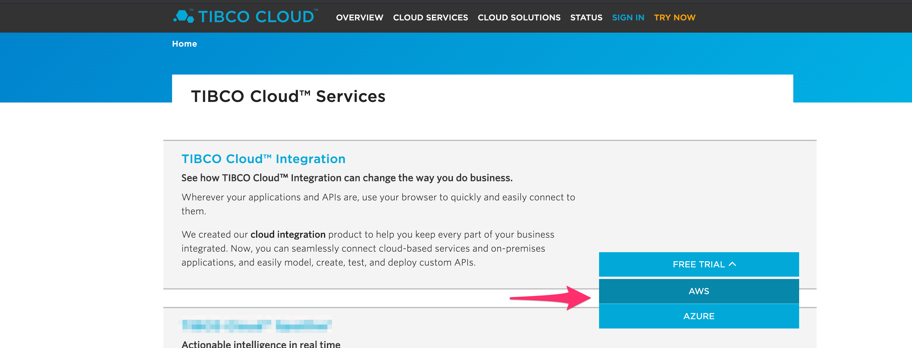
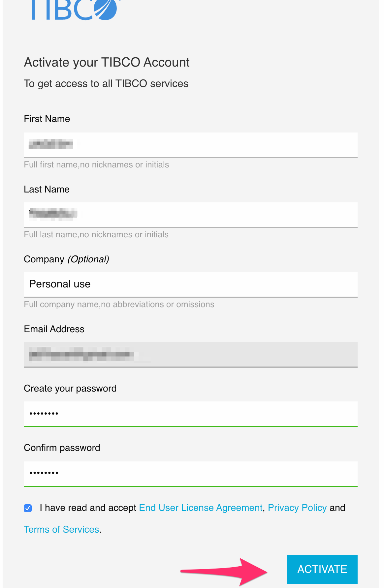
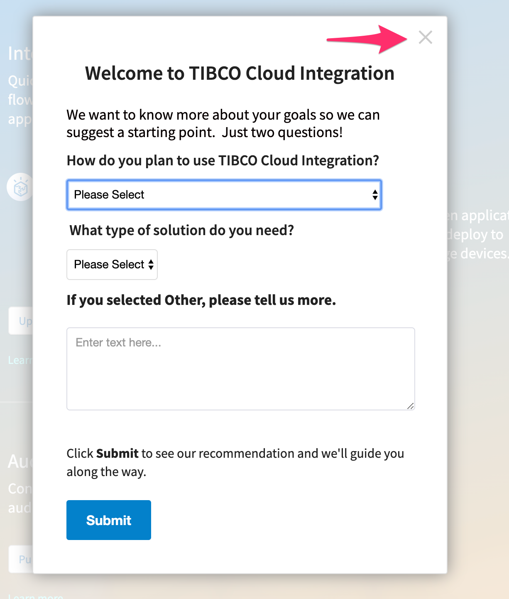
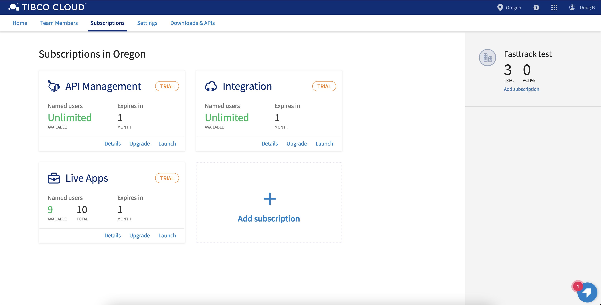

# Getting Started with TIBCO Cloud

The workshop requires a TIBCO Cloud account. Within that Cloud account, you'll signup to use **TIBCO Cloud Integration**, **TIBCO Live Apps** and **TIBCO API Management**

The following instructions walk you through getting your environment all setup.  In a new tab, follow this URL, [https://cloud.tibco.com/cloud-services](https://cloud.tibco.com/cloud-services).  Select **FREE TRIAL** and select AWS from the dropdown.

Enter your details and be sure to enter a valid email address to start your free trial.

 In about 30 seconds your cloud environment will be ready.  You'll receive an email to verify, activate, and set the password on your account.

 Click activate  

 and close the prompt on your login and you are setup with **TIBCO Cloud Integration** & **TIBCO API Management**.

To confirm you have access to what is needed for the workshop, click on **Subscriptions**. You should see three cards signifying that you have access to API Management, Integration, and Live Apps.

That's it!  You're ready for the workshop.

Next step: [Go Back to where you left off at the Introduction Page 'here' ](README.md#workshop-overview)
